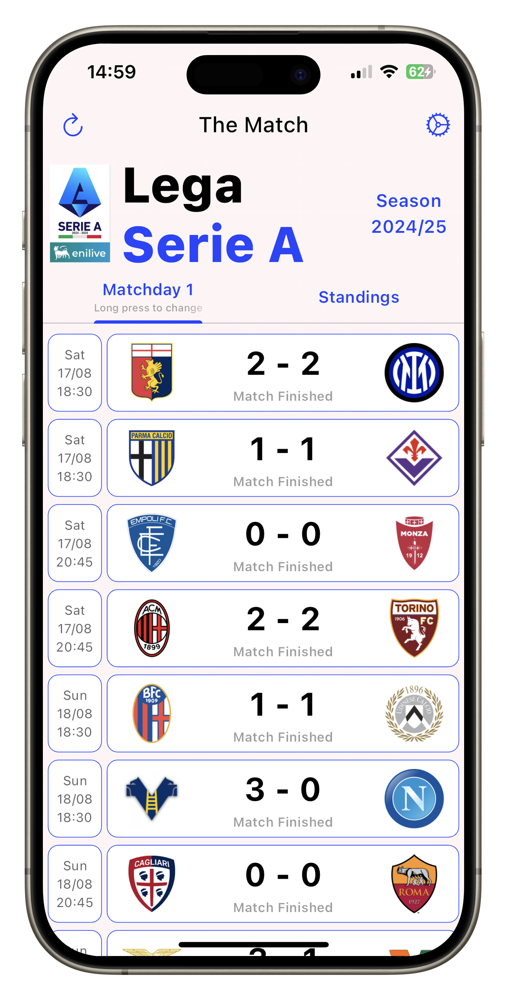
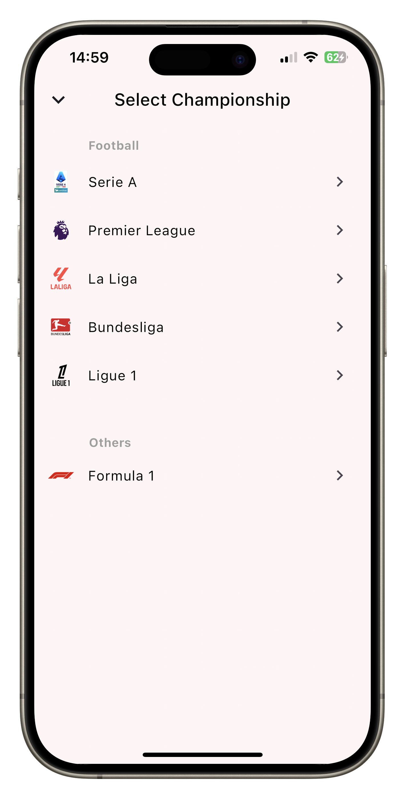
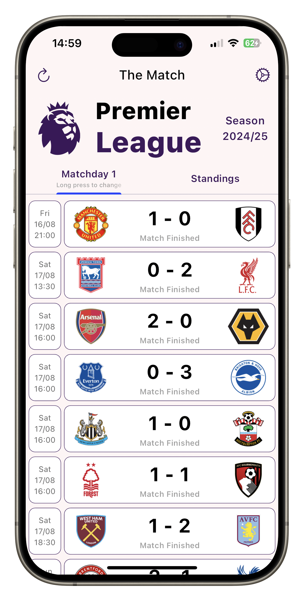
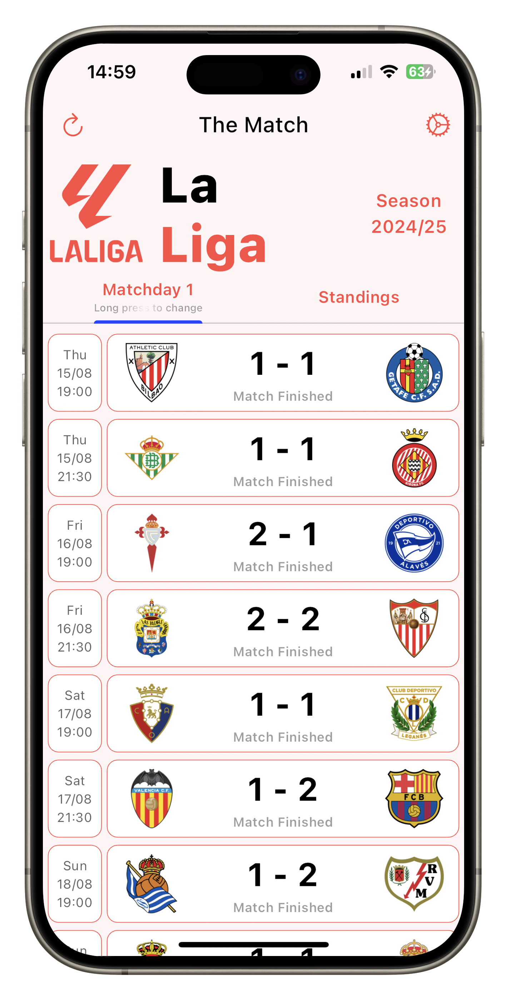
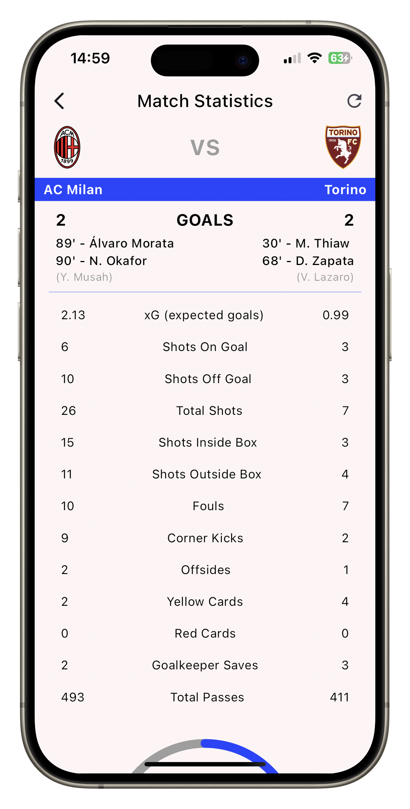
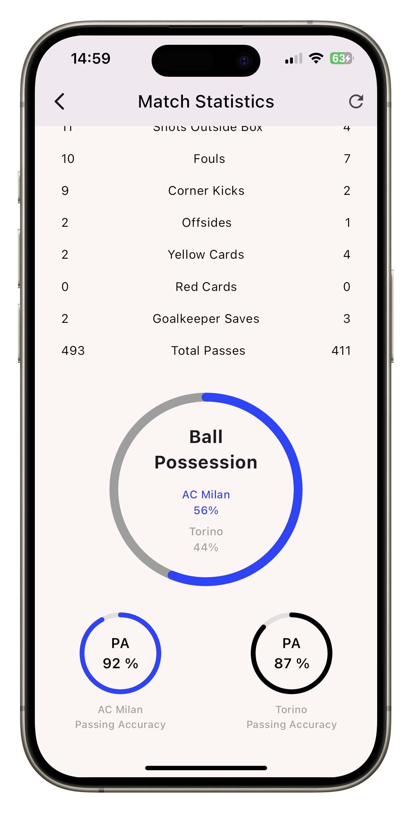
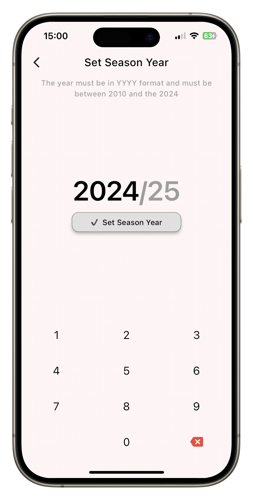
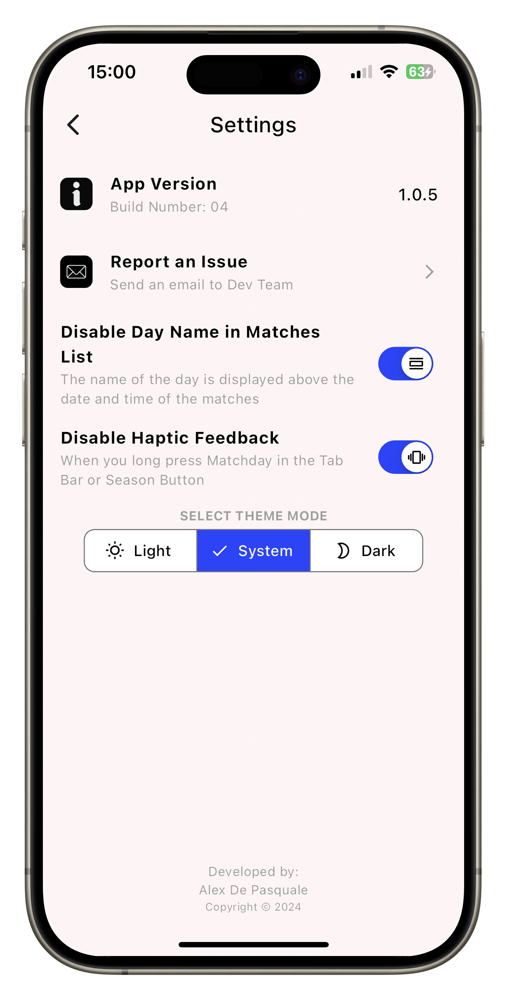
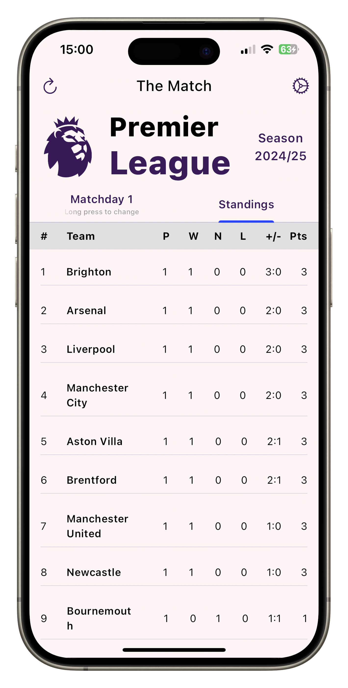

# The Match

Flutter project.

## About the app

The app allows you to:

- Check results of matches in best 5 EU leagues with score and data.
- View the standings.
- Select round.
- Select season year from 2010/11 to current season.
- View day and time of the match.
- View details stats of the match with goalscorers.
- Choose between light and dark theme.

- __Coming soon__ F1 race results and standings.

For the data the app uses the [api-football](https://www.api-football.com/) API.

## Some screenshots

<table>
    <tr>
        <td></td>
        <td></td>
        <td></td>
    </tr>
    <tr>
        <td></td>
        <td></td>
        <td></td>
    </tr>
    <tr>
        <td></td>
        <td></td>
        <td></td>
    </tr>
</table>
